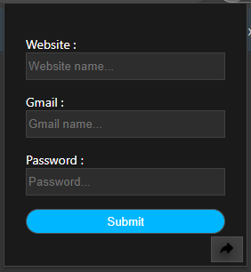
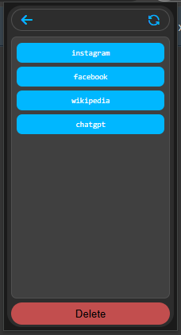
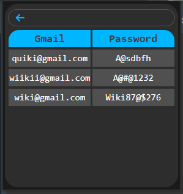

# 🔐 Password Saver Extension

**Author:** Mr. Manoj  
**Description:** A lightweight Chrome extension to manually store and organize registration details (domain, Gmail, and password) for multiple websites.

---

## 🧭 Overview

**Password Saver Extension** allows users to manually record their registration details for different websites.  
When you register on multiple sites, it becomes hard to remember which email and password you used — this extension solves that by letting you store them securely in one place.  

It organizes details based on each website and gives you an easy way to view, refresh, or delete your saved data.  

The extension contains **three main pages**:
1. **Add Form Page**
2. **Website List Page**
3. **Detail Page**

---

## 📸 Screenshot — Overview

  
*Example: show your extension popup or home UI here.*

---

## 🚀 Key Features

- Manually save **domain name**, **Gmail**, and **password**
- Organize data website-wise
- Refresh button to sync or reload data
- Delete all data (locally and from the server)
- Simple, responsive UI
- Easy navigation between pages

---

## 🧱 Page Structure and Flow

---

### 🧩 Page 1 — Add Form

This is the main page where you can **manually enter your registration details**.

**Fields:**
- Website Domain  
- Gmail  
- Password  

**Actions:**
- **Submit** → saves your details to local storage  
- **arrow button (bottom-right)** → navigates to the **Website List Page**

#### 📸 Screenshot — Add Form Page

---

### 🗂️ Page 2 — Website List

Shows all websites for which details are saved.

**Header:**
- Left → **Back Button** (returns to Add Form Page)  
- Right → **Refresh Button** (reloads/syncs data)

**Body:**  
Displays the list of websites (domain-wise).

**Footer:**  
Contains a **Delete All** button — removes all saved details from local storage and the server.

#### 📸 Screenshot — Website List Page

---

### 📜 Page 3 — Website Details

Displays all saved Gmail accounts and passwords for the selected website.

**Header:**  
Back button → returns to the **Website List Page**

**Body:**  
Shows multiple saved accounts for that domain, with email, password, and optional timestamps.

#### 📸 Screenshot — Website Details Page

---

## 🧩 Suggested File Structure

password-saver-extension/
├── manifest.json
│ 
├── popup.html/
├── content.js/
├── jquery.js/
├── popup.css/
├── assets/
│ ├── Gmail_new_Logo_16.png
│ ├── Gmail_new_Logo_32.png
│ ├── Gmail_new_Logo_48.png
│ ├── Gmail_new_Logo_128.png
│ ├── Gmail_new_Logo.png
│ ├── Page1.png
│ ├── Page2.png
│ ├── Page3.png
└── README.md